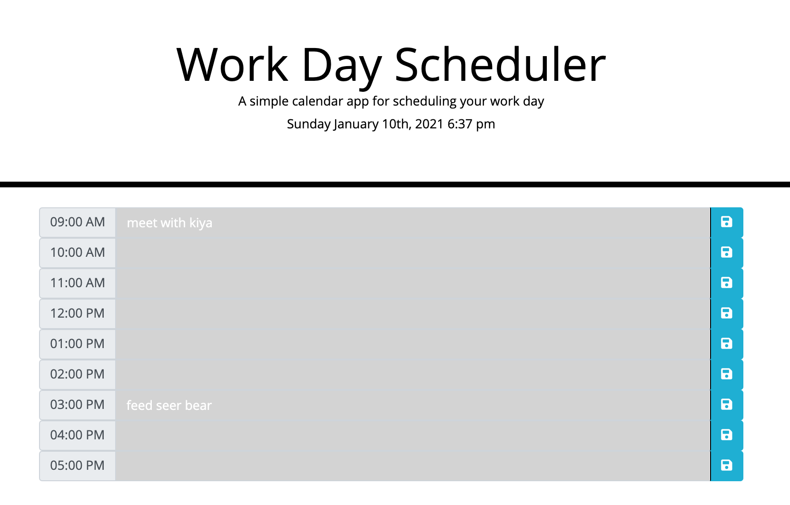

# Workday Scheduler

## Purpose

Workday Scheduler is an application that allows a user to save events for each hour of the day. This app runs in the browser and dynamically updates HTML and CSS powered by jQuery.

## Tech Stack

Workday Scheduler is built on the following:

- HTML
- CSS
- JavaScript
- jQuery
- [Moment.js](https://momentjs.com/)

## Development

Pull this repo and run this code in the browser

## Information
Below you will find a link to my repo and the live link

- https://github.com/cmabdulkadir/Work_Day_Scheduler
- https://cmabdulkadir.github.io/Work_Day_Scheduler/ 